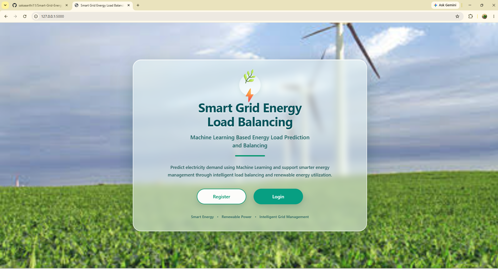

# ⚡ Smart Grid Energy Load Balancing

A Flask-based **Smart Grid Energy Load Balancing** web application that uses energy data and machine learning to support energy prediction and analysis.

## 🚀 Project Overview

The project provides a web-based interface for analyzing energy data and predicting energy-related values using a trained machine learning model.

It includes:

* 🔐 User Registration and Login
* 📊 Energy Data Analysis
* ⚡ Energy Load Prediction
* 📈 Energy Insights
* 🤖 Machine Learning Model
* 🗄️ MySQL Database Integration
* 🌐 Flask Web Application

## 🛠️ Technologies Used

* **Python**
* **Flask**
* **MySQL**
* **Pandas**
* **Scikit-learn**
* **Joblib**
* **HTML**
* **CSS**
* **Machine Learning**

## 📂 Project Structure

```text
Smart-Grid-Energy-Load-Balancing/
│
├── app.py
├── create_dataset.py
├── train_model.py
├── requirements.txt
│
├── dataset/
│   ├── energy_data.csv
│   └── smart_grid_data.csv
│
├── models/
│   └── model.pkl
│
├── templates/
│   ├── index.html
│   ├── login.html
│   ├── register.html
│   ├── prediction.html
│   ├── energy_insights.html
│   └── admin_login.html
│
└── static/
    └── images/
```

## ✨ Key Features

### 🔐 Authentication

Users can register and log in to access the application.

### ⚡ Energy Load Prediction

The application uses a trained machine learning model to generate energy-related predictions.

### 📊 Energy Insights

Users can view energy information and insights through the web interface.

### 🗄️ Database

MySQL is used to store application data.

## ▶️ How to Run Locally

### 1. Clone the repository

```bash
git clone https://github.com/sakaaarthi11/Smart-Grid-Energy-Load-Balancing.git
```

### 2. Open the project

```bash
cd Smart-Grid-Energy-Load-Balancing
```

### 3. Create a virtual environment

```bash
python -m venv venv
```

### 4. Activate the virtual environment

Windows PowerShell:

```powershell
.\venv\Scripts\Activate.ps1
```

### 5. Install dependencies

```bash
pip install -r requirements.txt
```

### 6. Configure MySQL

Create the required MySQL database and configure the database password in the `.env` file.

```text
MYSQL_PASSWORD=your_mysql_password
```

### 7. Run the application

```bash
python app.py
```

Then open:

```text
http://127.0.0.1:5000
```

## 📸 Screenshots

### 🏠 Home Page



### 🔐 Login Page


## 🎯 Project Objective

The objective of this project is to demonstrate how **Python, Flask, MySQL, data analysis, and machine learning** can be combined to build a web-based smart grid energy analysis and prediction application.

## 👩‍💻 Author

**Saka Aarthi**

B.Tech – Computer Science & Engineering
Hyderabad, Telangana, India
